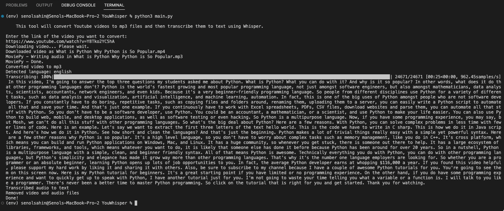
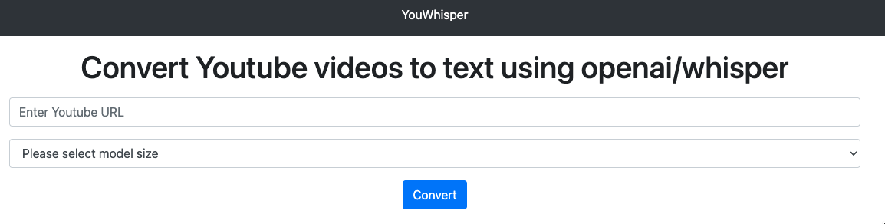

# YouWhisper
Convert YouTube videos to text using openai/whisper

# Usage

    python3 -m venv env
    source env/bin/activate
    pip install -r requirements.txt

It also requires the command-line tool [`ffmpeg`](https://ffmpeg.org/) to be installed on your system, which is available from most package managers:

```bash
# on Ubuntu or Debian
sudo apt update && sudo apt install ffmpeg

# on MacOS using Homebrew (https://brew.sh/)
brew install ffmpeg

# on Windows using Chocolatey (https://chocolatey.org/)
choco install ffmpeg

# on Windows using Scoop (https://scoop.sh/)
scoop install ffmpeg
```

You may need [`rust`](http://rust-lang.org) installed as well, in case [tokenizers](https://pypi.org/project/tokenizers/) does not provide a pre-built wheel for your platform. If you see installation errors during the `pip install` command above, please follow the [Getting started page](https://www.rust-lang.org/learn/get-started) to install Rust development environment.

# UI

If you would like to test it with web ui, you can run following and open **http://127.0.0.1:5000/** in your browser.

    flask --app webapp run

# Screenshot





