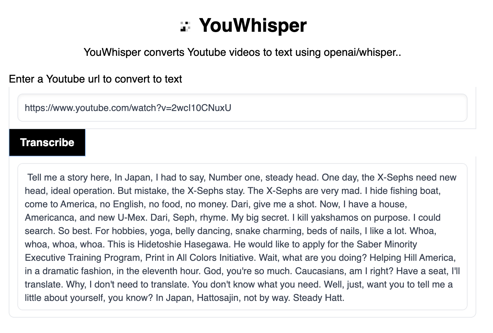

# YouWhisper
Convert YouTube videos to text using openai/whisper

# Demo

Demo here: https://huggingface.co/spaces/sensahin/YouWhisper

# Docker Install

On a local machine you can use `docker-compose up` and then open up http://localhost
Docker hosts like Render.com and DigitalOcean should just work with this repo.

# Usage

    python3 -m venv env
    source env/bin/activate
    pip install -r requirements.txt


You may need [`rust`](http://rust-lang.org) installed as well, in case [tokenizers](https://pypi.org/project/tokenizers/) does not provide a pre-built wheel for your platform. If you see installation errors during the `pip install` command above, please follow the [Getting started page](https://www.rust-lang.org/learn/get-started) to install Rust development environment.

# UI

If you would like to test it with web ui, you can run following and open **http://127.0.0.1:80/** in your browser.

```bash
python webapp.py
```

# Screenshot




# Docker

Live demo: https://whisper-dnrl.onrender.com/

Max memory consumption in tests is around 750mb. Works on Render.com (and probably DigitalOcean) as a Docker app with zero install.

However, the app is slow on a virtual cpu.

## Available models and languages

There are five model sizes, four with English-only versions, offering speed and accuracy tradeoffs. Below are the names of the available models and their approximate memory requirements and relative speed. 


|  Size  | Parameters | English-only model | Multilingual model | Required VRAM | Relative speed |
|:------:|:----------:|:------------------:|:------------------:|:-------------:|:--------------:|
|  tiny  |    39 M    |     `tiny.en`      |       `tiny`       |     ~1 GB     |      ~32x      |
|  base  |    74 M    |     `base.en`      |       `base`       |     ~1 GB     |      ~16x      |
| small  |   244 M    |     `small.en`     |      `small`       |     ~2 GB     |      ~6x       |
| medium |   769 M    |    `medium.en`     |      `medium`      |     ~5 GB     |      ~2x       |
| large  |   1550 M   |        N/A         |      `large`       |    ~10 GB     |       1x       |

For English-only applications, the `.en` models tend to perform better, especially for the `tiny.en` and `base.en` models. We observed that the difference becomes less significant for the `small.en` and `medium.en` models.

Whisper's performance varies widely depending on the language. The figure below shows a WER breakdown by languages of Fleurs dataset, using the `large` model. More WER and BLEU scores corresponding to the other models and datasets can be found in Appendix D in [the paper](https://cdn.openai.com/papers/whisper.pdf).

